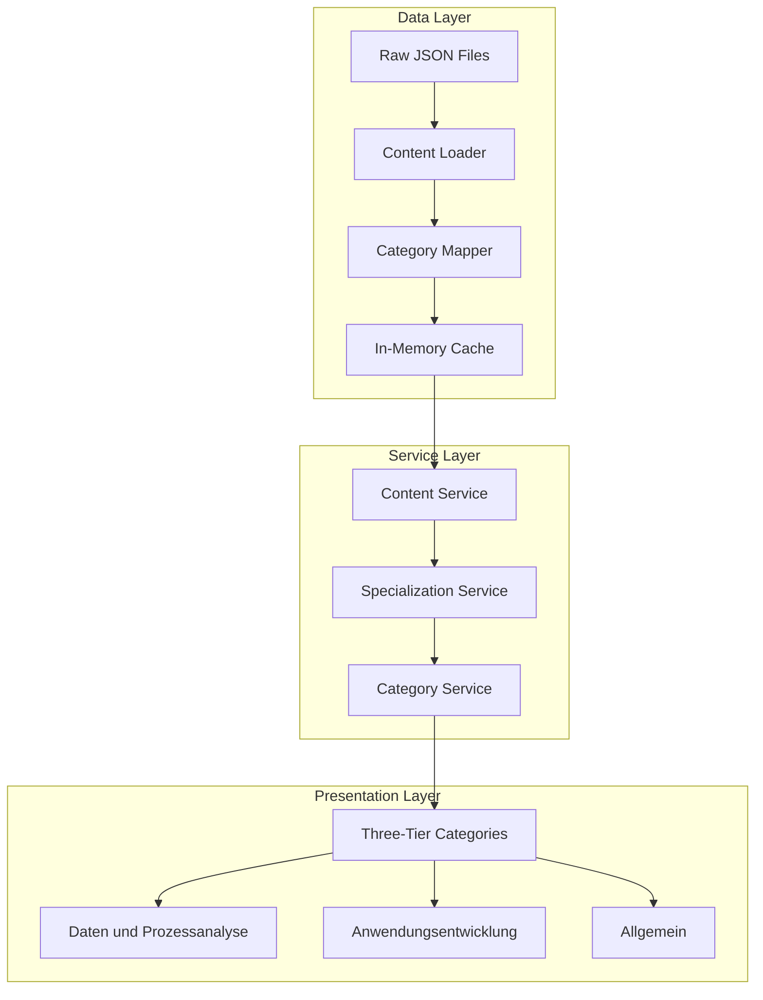

# Design Document

## Overview

This design document outlines the restructuring of the IHK learning content into three main categories: "Daten und Prozessanalyse" (DPA), "Anwendungsentwicklung" (AE), and "Allgemein" (General). The solution maintains the existing local file-based architecture while introducing a more intuitive categorization system that better serves both specializations.

The design leverages the existing specialization service and category metadata to create a seamless transition from the current structure to the new three-tier organization, ensuring backward compatibility and optimal performance.

## Architecture

### Current State Analysis

The existing system has:

- **File Structure**: Organized by content type (`modules/`, `quizzes/`) with mixed categorization
- **Category System**: Complex hierarchical structure with FÜ (general), BP-AE (application development), and BP-DPA (data analysis) prefixes
- **Specialization Service**: Already handles content filtering based on relevance
- **Content Loading**: Static imports with in-memory caching

### Target Architecture



### Three-Tier Category System

1. **"Daten und Prozessanalyse"** - Content with high relevance for DPA specialization
2. **"Anwendungsentwicklung"** - Content with high relevance for AE specialization
3. **"Allgemein"** - Content relevant for both specializations or general IT knowledge

## Components and Interfaces

### 1. Enhanced Category Mapping Service

```typescript
interface CategoryMappingService {
  // Map existing categories to three-tier system
  mapToThreeTierCategory(contentItem: ContentItem): ThreeTierCategory;

  // Get category relevance for specialization
  getCategoryRelevance(
    category: string,
    specialization: string
  ): RelevanceLevel;

  // Validate category assignments
  validateCategoryMapping(contentItems: ContentItem[]): ValidationResult;
}

interface ThreeTierCategory {
  id: 'daten-prozessanalyse' | 'anwendungsentwicklung' | 'allgemein';
  name: string;
  description: string;
  color: string;
  icon: string;
}
```

### 2. Enhanced Content Service

```typescript
interface EnhancedContentService extends IHKContentService {
  // Get content by three-tier category
  getContentByThreeTierCategory(
    category: ThreeTierCategory['id']
  ): Promise<ContentItem[]>;

  // Get content with category metadata
  getContentWithCategoryInfo(
    specializationId?: string
  ): Promise<CategorizedContent>;

  // Search within specific three-tier category
  searchInCategory(
    query: string,
    category: ThreeTierCategory['id']
  ): Promise<ContentItem[]>;
}

interface CategorizedContent {
  'daten-prozessanalyse': {
    modules: ModuleItem[];
    quizzes: QuizItem[];
    relevance: RelevanceLevel;
  };
  anwendungsentwicklung: {
    modules: ModuleItem[];
    quizzes: QuizItem[];
    relevance: RelevanceLevel;
  };
  allgemein: {
    modules: ModuleItem[];
    quizzes: QuizItem[];
    relevance: RelevanceLevel;
  };
}
```

### 3. Category Configuration

```typescript
interface CategoryConfiguration {
  threeTierCategories: ThreeTierCategory[];
  mappingRules: CategoryMappingRule[];
  specializationRelevance: SpecializationRelevanceMap;
}

interface CategoryMappingRule {
  sourceCategory: string; // e.g., "BP-DPA-01", "FÜ-02"
  targetCategory: ThreeTierCategory['id'];
  condition?: MappingCondition;
  priority: number;
}

interface MappingCondition {
  specializationRelevance?: {
    [specializationId: string]: RelevanceLevel;
  };
  contentType?: 'module' | 'quiz';
  tags?: string[];
}
```

## Data Models

### Enhanced Content Item Structure

```typescript
interface EnhancedContentItem extends ContentItem {
  // Original category (preserved for backward compatibility)
  category: string;

  // New three-tier category assignment
  threeTierCategory: ThreeTierCategory['id'];

  // Relevance for each specialization
  specializationRelevance: {
    anwendungsentwicklung: RelevanceLevel;
    'daten-prozessanalyse': RelevanceLevel;
  };

  // Cross-category relationships
  relatedContent?: {
    category: ThreeTierCategory['id'];
    contentIds: string[];
    relationshipType: 'prerequisite' | 'related' | 'advanced';
  }[];
}
```

### Category Metadata Structure

```typescript
interface CategoryMetadata {
  id: ThreeTierCategory['id'];
  name: string;
  description: string;
  color: string;
  icon: string;

  // Content statistics
  contentStats: {
    totalModules: number;
    totalQuizzes: number;
    difficultyDistribution: {
      beginner: number;
      intermediate: number;
      advanced: number;
    };
  };

  // Specialization relevance
  specializationRelevance: {
    [specializationId: string]: {
      relevance: RelevanceLevel;
      description: string;
      recommendedOrder?: number;
    };
  };
}
```

## Implementation Strategy

### Phase 1: Category Mapping Infrastructure

1. **Create Category Mapping Service**
   - Implement mapping rules based on existing category structure
   - Define three-tier category configurations
   - Create validation logic for category assignments

2. **Extend Content Loading**
   - Enhance content loader to apply category mapping
   - Maintain backward compatibility with existing category references
   - Add three-tier category metadata to loaded content

### Phase 2: Service Layer Enhancement

1. **Enhance IHKContentService**
   - Add methods for three-tier category filtering
   - Implement category-aware search functionality
   - Create cross-category relationship mapping

2. **Update SpecializationService**
   - Integrate three-tier category system
   - Enhance relevance calculation for new categories
   - Maintain existing specialization filtering logic

### Phase 3: Data Migration and Validation

1. **Content Analysis and Mapping**
   - Analyze existing content for optimal category assignment
   - Create mapping rules for edge cases
   - Validate category assignments against business rules

2. **Progress Migration**
   - Ensure user progress maps correctly to new categories
   - Preserve completion status and quiz attempts
   - Update progress tracking for three-tier system

## Category Assignment Logic

### Mapping Rules Priority

1. **Explicit DPA Content** (Highest Priority)
   - Content with `bp-dpa-*` prefix → "Daten und Prozessanalyse"
   - Content with high DPA relevance and low AE relevance

2. **Explicit AE Content**
   - Content with `bp-ae-*` prefix → "Anwendungsentwicklung"
   - Content with high AE relevance and low DPA relevance

3. **General Content** (Default)
   - Content with `fue-*` prefix → "Allgemein"
   - Content with high relevance for both specializations
   - Content without clear specialization preference

### Detailed Mapping Configuration

```typescript
const categoryMappingRules: CategoryMappingRule[] = [
  // DPA-specific content
  {
    sourceCategory: /^BP-DPA-/,
    targetCategory: 'daten-prozessanalyse',
    priority: 100,
  },
  {
    sourceCategory: /^bp-dpa-/,
    targetCategory: 'daten-prozessanalyse',
    priority: 100,
  },

  // AE-specific content
  {
    sourceCategory: /^BP-AE-/,
    targetCategory: 'anwendungsentwicklung',
    priority: 100,
  },
  {
    sourceCategory: /^bp-ae-/,
    targetCategory: 'anwendungsentwicklung',
    priority: 100,
  },

  // General content (FÜ prefix)
  {
    sourceCategory: /^FÜ-|^fue-/,
    targetCategory: 'allgemein',
    priority: 90,
  },

  // Content by relevance analysis
  {
    sourceCategory: /.*/,
    targetCategory: 'daten-prozessanalyse',
    condition: {
      specializationRelevance: {
        'daten-prozessanalyse': 'high',
        anwendungsentwicklung: 'low',
      },
    },
    priority: 80,
  },
  {
    sourceCategory: /.*/,
    targetCategory: 'anwendungsentwicklung',
    condition: {
      specializationRelevance: {
        anwendungsentwicklung: 'high',
        'daten-prozessanalyse': 'low',
      },
    },
    priority: 80,
  },

  // Default to general
  {
    sourceCategory: /.*/,
    targetCategory: 'allgemein',
    priority: 1,
  },
];
```

## Error Handling

### Category Assignment Validation

1. **Missing Category Mapping**
   - Log warning for unmapped content
   - Default to "Allgemein" category
   - Provide suggestions for proper categorization

2. **Conflicting Category Rules**
   - Use priority-based resolution
   - Log conflicts for manual review
   - Provide validation reports

3. **Invalid Content Structure**
   - Graceful degradation to basic categorization
   - Preserve existing functionality
   - Generate error reports for content fixes

### Backward Compatibility

1. **Legacy Category References**
   - Maintain original category field
   - Provide mapping from old to new categories
   - Support both category systems during transition

2. **Service API Compatibility**
   - Preserve existing method signatures
   - Add new methods without breaking changes
   - Provide deprecation warnings for old patterns

## Testing Strategy

### Unit Testing

1. **Category Mapping Logic**
   - Test all mapping rules with sample content
   - Verify priority-based rule resolution
   - Test edge cases and invalid inputs

2. **Content Service Methods**
   - Test three-tier category filtering
   - Verify cross-category relationship handling
   - Test search functionality within categories

### Integration Testing

1. **End-to-End Content Loading**
   - Test complete content loading pipeline
   - Verify category assignments for all content
   - Test performance with full content set

2. **Specialization Integration**
   - Test category relevance calculation
   - Verify specialization-based filtering
   - Test user progress preservation

### Performance Testing

1. **Content Loading Performance**
   - Measure category mapping overhead
   - Test in-memory cache efficiency
   - Verify response times meet requirements (<100ms)

2. **Search Performance**
   - Test category-filtered search performance
   - Measure cross-category relationship queries
   - Verify scalability with content growth

## Migration Plan

### Pre-Migration Analysis

1. **Content Audit**
   - Analyze all existing modules and quizzes
   - Identify category assignment conflicts
   - Generate migration report with recommendations

2. **User Impact Assessment**
   - Analyze user progress data
   - Identify potential migration issues
   - Plan communication strategy

### Migration Execution

1. **Gradual Rollout**
   - Deploy category mapping service
   - Enable three-tier categories alongside existing system
   - Monitor performance and user feedback

2. **Data Validation**
   - Verify all content has proper category assignments
   - Validate user progress migration
   - Test all service integrations

3. **Cleanup**
   - Remove deprecated category references
   - Update documentation and examples
   - Archive migration tools and reports

## Performance Considerations

### Caching Strategy

1. **Category Metadata Caching**
   - Cache category configurations in memory
   - Refresh on configuration changes
   - Implement cache invalidation strategy

2. **Content Category Caching**
   - Cache category assignments with content
   - Use efficient data structures for lookups
   - Minimize memory footprint

### Optimization Techniques

1. **Lazy Loading**
   - Load category metadata on demand
   - Defer cross-category relationship resolution
   - Implement progressive content loading

2. **Efficient Filtering**
   - Use indexed data structures for category filtering
   - Implement efficient search algorithms
   - Optimize for common query patterns

## Security Considerations

### Data Integrity

1. **Category Assignment Validation**
   - Validate category assignments against business rules
   - Prevent unauthorized category modifications
   - Maintain audit trail for category changes

2. **Content Access Control**
   - Respect existing content access permissions
   - Ensure category-based filtering doesn't bypass security
   - Validate user permissions for category access

### Privacy Protection

1. **User Progress Privacy**
   - Maintain existing privacy protections during migration
   - Ensure category-based analytics respect user privacy
   - Implement proper data anonymization for reporting
