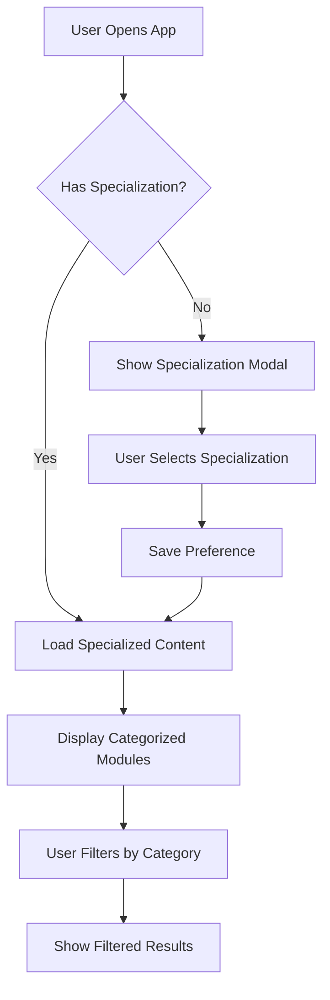

# Design Document

## Overview

This design document outlines the integration of "Fachinformatiker für Daten und Prozessanalyse" content into the existing learning application. The solution introduces a three-tier categorization system while maintaining backward compatibility and seamless user experience.

The design leverages the existing IHK content infrastructure and extends the metadata system to support multiple specializations. Users will be able to select their specialization and access relevant content while maintaining access to general Fachinformatiker topics.

## Architecture

### High-Level Architecture

The integration follows the existing service-oriented architecture pattern:

```
┌─────────────────────────────────────────────────────────────┐
│                    User Interface Layer                     │
├─────────────────────────────────────────────────────────────┤
│  Navigation │ ModuleListView │ QuizListView │ ProgressView  │
│             │ (Enhanced)     │ (Enhanced)   │ (Enhanced)    │
└─────────────────────────────────────────────────────────────┘
                              │
┌─────────────────────────────────────────────────────────────┐
│                    Service Layer                            │
├─────────────────────────────────────────────────────────────┤
│ SpecializationService │ ModuleService │ QuizService         │
│ (New)                 │ (Enhanced)    │ (Enhanced)          │
│                       │               │                     │
│ IHKContentService     │ ProgressService │ StateManager      │
│ (Enhanced)            │ (Enhanced)      │ (Enhanced)        │
└─────────────────────────────────────────────────────────────┘
                              │
┌─────────────────────────────────────────────────────────────┐
│                    Data Layer                               │
├─────────────────────────────────────────────────────────────┤
│ categories.json │ modules/ │ quizzes/ │ specializations.json│
│ (Enhanced)      │ (New DP) │ (New DP) │ (New)               │
└─────────────────────────────────────────────────────────────┘
```

### Specialization Management

A new `SpecializationService` will manage user specialization preferences and content filtering:

- **Specialization Selection**: Users choose between "Anwendungsentwicklung" and "Daten und Prozessanalyse"
- **Content Filtering**: Dynamic filtering based on specialization and category relevance
- **Preference Persistence**: User choices stored in localStorage with StateManager

## Components and Interfaces

### New Components

#### SpecializationService

```javascript
class SpecializationService {
  constructor(stateManager, storageService)

  // Core methods
  getAvailableSpecializations()
  getCurrentSpecialization()
  setSpecialization(specializationId)
  getSpecializationConfig(specializationId)

  // Content filtering
  filterContentBySpecialization(content, specializationId)
  getCategoryRelevance(categoryId, specializationId)
}
```

#### SpecializationSelector Component

```javascript
class SpecializationSelector {
  constructor(specializationService, onSelectionChange)

  render()
  handleSpecializationChange(specializationId)
  showSpecializationModal()
}
```

### Enhanced Components

#### ModuleService (Enhanced)

```javascript
// New methods added to existing ModuleService
class ModuleService {
  // Existing methods remain unchanged

  // New methods for specialization support
  getModulesBySpecialization(specializationId)
  getModulesByCategory(categoryId, specializationId)
  getCategorizedModules(specializationId)
}
```

#### Navigation (Enhanced)

The navigation will include a specialization indicator and selector:

```javascript
// Enhanced navigation with specialization display
<div class="nav-specialization">
  <span class="specialization-label">Fachrichtung:</span>
  <button class="specialization-selector" aria-label="Change specialization">
    <span class="specialization-name">{currentSpecialization}</span>
    <span class="specialization-icon">⚙️</span>
  </button>
</div>
```

## Data Models

### Specialization Configuration

```json
{
  "specializations": [
    {
      "id": "anwendungsentwicklung",
      "name": "Anwendungsentwicklung",
      "shortName": "AE",
      "description": "Fachinformatiker für Anwendungsentwicklung",
      "color": "#10b981",
      "icon": "💻",
      "examCode": "AP2-AE"
    },
    {
      "id": "daten-prozessanalyse",
      "name": "Daten- und Prozessanalyse",
      "shortName": "DPA",
      "description": "Fachinformatiker für Daten- und Prozessanalyse",
      "color": "#3b82f6",
      "icon": "📊",
      "examCode": "AP2-DPA"
    }
  ]
}
```

### Enhanced Category Model

```json
{
  "categories": [
    {
      "id": "FUE",
      "name": "Fachrichtungsübergreifend",
      "relevance": {
        "anwendungsentwicklung": "high",
        "daten-prozessanalyse": "high"
      },
      "subcategories": [...]
    },
    {
      "id": "BP-AE",
      "name": "Berufsprofilgebend Anwendungsentwicklung",
      "relevance": {
        "anwendungsentwicklung": "high",
        "daten-prozessanalyse": "none"
      }
    },
    {
      "id": "BP-DPA",
      "name": "Berufsprofilgebend Daten- und Prozessanalyse",
      "relevance": {
        "anwendungsentwicklung": "none",
        "daten-prozessanalyse": "high"
      }
    }
  ]
}
```

### Module Metadata Enhancement

```json
{
  "id": "dpa-01-data-modeling",
  "title": "Datenmodellierung und ER-Diagramme",
  "specialization": "daten-prozessanalyse",
  "categoryRelevance": {
    "anwendungsentwicklung": "low",
    "daten-prozessanalyse": "high"
  },
  "tags": ["datenmodellierung", "er-diagramm", "normalisierung"],
  "examRelevance": "high"
}
```

## Content Structure for Daten und Prozessanalyse

### Core Topic Areas

#### 1. Fachrichtungsübergreifende Inhalte (FÜ)

- **FÜ-01**: Planen eines Softwareproduktes
- **FÜ-02**: Entwickeln und Bereitstellen von Softwareanwendungen
- **FÜ-03**: Durchführen von qualitätssichernden Maßnahmen
- **FÜ-04**: Sicherstellen der Informationssicherheit

#### 2. Berufsprofilgebende Inhalte Daten- und Prozessanalyse (BP-DPA)

- **BP-DPA-01**: Daten erfassen, aufbereiten und auswerten
  - Datenquellen identifizieren und bewerten
  - ETL-Prozesse (Extract, Transform, Load)
  - Datenqualität sicherstellen
  - Statistische Grundlagen

- **BP-DPA-02**: Datenmodelle entwickeln und implementieren
  - ER-Modellierung und Normalisierung
  - Dimensionale Modellierung (Star/Snowflake Schema)
  - NoSQL-Datenmodelle
  - Data Warehouse Konzepte

- **BP-DPA-03**: Geschäftsprozesse analysieren und optimieren
  - Prozessmodellierung (BPMN)
  - Workflow-Analyse
  - KPI-Definition und -Messung
  - Process Mining

- **BP-DPA-04**: Datenvisualisierung und Reporting
  - Dashboard-Design
  - Business Intelligence Tools
  - Datenvisualisierung Best Practices
  - Self-Service Analytics

- **BP-DPA-05**: Big Data und Analytics
  - Big Data Technologien (Hadoop, Spark)
  - Machine Learning Grundlagen
  - Predictive Analytics
  - Data Lakes vs. Data Warehouses

### Sample Module Topics

```json
[
  {
    "id": "dpa-data-modeling",
    "title": "Datenmodellierung mit ER-Diagrammen",
    "topics": ["ER-Diagramme", "Normalisierung", "Kardinalitäten", "Schlüssel"]
  },
  {
    "id": "dpa-etl-processes",
    "title": "ETL-Prozesse und Datenintegration",
    "topics": ["Extract", "Transform", "Load", "Datenqualität", "Talend"]
  },
  {
    "id": "dpa-process-modeling",
    "title": "Geschäftsprozessmodellierung mit BPMN",
    "topics": ["BPMN 2.0", "Prozessoptimierung", "Workflow", "Automatisierung"]
  },
  {
    "id": "dpa-bi-dashboards",
    "title": "Business Intelligence Dashboards",
    "topics": ["Power BI", "Tableau", "KPIs", "Datenvisualisierung"]
  }
]
```

## User Experience Flow

### Initial User Experience

1. **First Visit**: User sees specialization selection modal
2. **Specialization Choice**: User selects "Anwendungsentwicklung" or "Daten und Prozessanalyse"
3. **Content Filtering**: Application shows relevant content based on selection
4. **Navigation**: Specialization indicator in navigation bar

### Content Discovery Flow



### Content Categorization Visual Design

```
┌─────────────────────────────────────────────────────────────┐
│                    Module List View                         │
├─────────────────────────────────────────────────────────────┤
│ Filter: [All] [General] [Anwendungsentwicklung] [Daten-PA] │
├─────────────────────────────────────────────────────────────┤
│ 🔵 General: IT-Projektmanagement                           │
│ 🟢 AE: Objektorientierte Programmierung                    │
│ 🔵 General: IT-Sicherheit Grundlagen                       │
│ 🟦 DPA: Datenmodellierung mit ER-Diagrammen               │
│ 🟦 DPA: ETL-Prozesse und Datenintegration                 │
└─────────────────────────────────────────────────────────────┘
```

## Error Handling

### Specialization Selection Errors

- **No Selection**: Graceful fallback to general content with persistent modal
- **Invalid Selection**: Reset to default with user notification
- **Storage Errors**: Use session storage as fallback

### Content Loading Errors

- **Missing Specialization Content**: Show general content with informational message
- **Category Filter Errors**: Reset filters and show all content
- **Module Loading Failures**: Individual module error handling with retry options

## Testing Strategy

### Unit Testing

- **SpecializationService**: Test specialization management and content filtering
- **Enhanced ModuleService**: Test specialization-aware module retrieval
- **Content Categorization**: Test category relevance calculations

### Integration Testing

- **Specialization Flow**: End-to-end specialization selection and content filtering
- **Content Switching**: Test switching between specializations
- **Progress Preservation**: Ensure progress is maintained across specialization changes

### User Acceptance Testing

- **Specialization Selection UX**: Test modal flow and user understanding
- **Content Discovery**: Test ability to find relevant content
- **Visual Categorization**: Test clarity of category indicators

### Accessibility Testing

- **Screen Reader Support**: Test specialization selection with screen readers
- **Keyboard Navigation**: Ensure all specialization features are keyboard accessible
- **Color Contrast**: Verify category color indicators meet WCAG standards

## Performance Considerations

### Content Loading Optimization

- **Lazy Loading**: Load specialization-specific content on demand
- **Caching Strategy**: Cache filtered content results to avoid repeated filtering
- **Bundle Splitting**: Consider separate bundles for specialization-specific content

### Memory Management

- **Content Filtering**: Efficient filtering algorithms to avoid performance impact
- **State Management**: Optimize state updates for specialization changes
- **Component Rendering**: Minimize re-renders when switching content views

## Migration Strategy

### Backward Compatibility

- **Existing Users**: Automatically assign "Anwendungsentwicklung" specialization
- **Data Migration**: Preserve all existing progress and preferences
- **URL Compatibility**: Maintain existing route structure

### Rollout Plan

1. **Phase 1**: Deploy enhanced data structure and services
2. **Phase 2**: Add specialization selection UI
3. **Phase 3**: Deploy Daten und Prozessanalyse content
4. **Phase 4**: Enable content categorization and filtering

This design ensures seamless integration of the new specialization system while maintaining the existing user experience and providing a clear path for content expansion.
